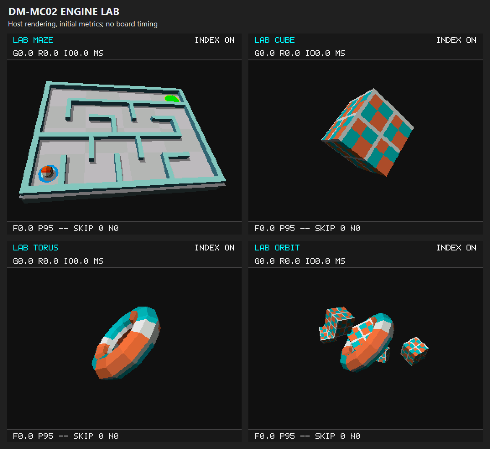

# DM-MC02 Soft3D Engine Lab

A C software-rendering engine and embedded performance experiment platform
for the STM32H723 Cortex-M7 and the DM-MC02 280 x 240 SPI LCD. It renders
textured geometry without a GPU or full-screen firmware framebuffer. The
onboard BMI088 also controls a gravity-maze workload using Fusion AHRS and
cute_c2 collision detection; no additional hardware is required.

The current build identifies itself as `ENGINE LAB V4`. It adds ordered
triangle selection through screen-band bitmaps, vertex outcodes, an Euler
trigonometry cache, and on-board 64-frame profiling. LAB compares maze,
cube, torus and orbit workloads using repeatable poses and fixed transfer
volume. See [the engine design](Docs/ENGINE.md) for the algorithms, timing
boundaries and comparison method.



This preview uses the actual C renderer and LAB UI on a PC. Its zero metrics
are initial values with no timing samples collected, not measured execution
times. It is neither a board photograph nor a performance result.

The recorded host comparison has mixed results: 9 of 20 workloads improve
and 11 regress, with paired reference/current total-time ratios from 0.837x
to 1.374x. Values above 1 mean faster; values below 1 mean slower. These are
host CPU measurements, not STM32 or LCD FPS. Raw measurements and provenance
are in [pipeline-benchmark.json](Docs/pipeline-benchmark.json), with the current
verification status in [VALIDATION.md](Docs/VALIDATION.md).

## Engine Lab

After the status page, short-press center to enter the maze, then short-press
down to open LAB. LAB runs even while the IMU is calibrating or unavailable.
It uses a deterministic 64-frame pose sequence, so each complete statistics
window covers the same poses. It sends all 15 bands each frame: 134,400 RGB565
payload bytes regardless of object size.

| LAB key | Action |
| --- | --- |
| Right | Cycle `MAZE`, `CUBE`, `TORUS`, `ORBIT`; reset pose and statistics |
| Left | Toggle `INDEX ON` / `INDEX OFF`; reset statistics and animated sequence, preserve held pose |
| Center, short press | Hold/resume animation; reset statistics |
| Center, hold about 0.8 s | Reset pose and statistics; resume animation |
| Down, short press | Return to the maze |
| Down, hold about 0.8 s | Status page; short center resumes LAB |

`G`, `R` and `IO` show mean geometry, raster and transfer-wait milliseconds.
`F`, `P95` and `N` show mean frame time, the 64-frame nearest-rank percentile,
and the represented sample count. `SKIP` is the percentage of triangle
candidate visits removed, not a CPU-time or pixel reduction.

Only completed frames enter the profiler. Before the first 64-frame window
fills, means and maximum are available but P95 is not. Afterward, the last
complete window stays published while the next non-overlapping window fills.
Switching modes, workloads or index traversal, holding/resuming animation,
visiting status, and error recovery reset the window.

`INDEX OFF` changes candidate traversal only: it retains bitmap construction,
outcodes and the trig cache. It is an on-board A/B control for that one stage,
not a switch back to the complete V3 renderer. The frozen-reference host
benchmark compares the full V3 and V4 cores instead.

## Build and Run

Open `MDK-ARM/DM_MC02_Soft3D.uvprojx` in Keil MDK, select the
`DM_MC02_Soft3D` target, and build. The verified toolchain is ARM Compiler
5.06 update 5 (build 528), with C99 enabled.

From PowerShell in this directory:

```powershell
.\Tools\test.ps1
.\Tools\build.ps1 -Uv4Path 'E:\tools\keil\UV4\UV4.exe' -Rebuild
```

`Tools/test.ps1` requires native GCC on PATH, or `-Compiler` with its path.
The build script accepts `KEIL_UV4_PATH` and searches installed Keil entries.

The V4 firmware artifact is
[`Firmware/DM_MC02_Soft3D_EngineLab_v4.hex`](Firmware/DM_MC02_Soft3D_EngineLab_v4.hex).
Flash it through the board's SWD connection. New local builds produce
`MDK-ARM/DM_MC02_Soft3D/DM_MC02_Soft3D.hex`. After reset, the display should
show `ENGINE LAB V4` and the operation/status page. A short center press
enters the maze; short down opens LAB. Build results, firmware checksum and
pending board checks are recorded in [`Docs/VALIDATION.md`](Docs/VALIDATION.md).

The previous maze firmware is retained for rollback:
[`DM_MC02_Soft3D_Maze01_v3.hex`](Firmware/DM_MC02_Soft3D_Maze01_v3.hex).
The earlier cube/torus/orbit display build is also retained as
`Firmware/DM_MC02_Soft3D_DisplayFix04.hex`.

### Maze Keypad

| Key | Action |
| --- | --- |
| Center, short press | Status page: resume the current mode; maze: pause/resume |
| Center, hold about 0.8 s | Restart the selected level and capture a new neutral pose |
| Up | Set the current pose as neutral, stopping the ball without resetting its position or time |
| Down, hold about 0.8 s | Return to the operation/status page |
| Right | Select the next deterministic level, restart and clear the level's best time |
| Down, short press | Open Engine Lab |
| Left | No maze action; in LAB this toggles the band index |

Each action requires a new press, with 60 ms press and release debounce.
Center and down short presses are emitted after release, and a hold never
also emits a short press. An ADC failure cancels the pending gesture and
requires a stable release before accepting a new press.
Only a short center press acts on the status page. The game footer shows
elapsed play time and the selected level's best time this startup. Rendering and
keys remain active when the ball is paused or waiting for valid sensor data.
LAB preserves maze position, rolling orientation and elapsed time; it clears
velocity and returns without catching up on time spent in the lab.

### Board-Motion Control

Keep the board still for about five seconds after startup: two seconds of
quiet samples estimate gyro bias, followed by Fusion's startup convergence.
The maze uses IMU control; LAB uses its fixed pose sequence independently.
The first valid pose after entering or restarting the maze becomes neutral.
Press up with the board held steadily to capture another neutral pose.

The header identifies the active state: `IMU`, `CAL` (calibrating),
`GYRO` (accelerometer correction rejected), `WAIT` (invalid or stale sample),
`PAUSED`, or `NO IMU` (sensor communication unavailable). Sensor loss stops the
ball and clears its velocity. The first valid frame after recovery consumes
no elapsed simulation time. Sensor communication retries independently of
the LCD.

The game derives board-plane gravity from normalized relative quaternions;
there is no intermediate Euler conversion. Positive rotation about sensor Y
drives the ball toward -x, and positive rotation about X drives it toward +y.
Screen x points right and y points up. Physical board-axis correspondence
and comfortable neutral poses need to be checked on the board.
The no-magnetometer fusion provides relative yaw, not an absolute compass
heading. Yaw drift is expected. Calibration requires actual stillness: slow
constant yaw cannot always be distinguished from bias with these sensors alone.

## Maze Physics

`Game/soft3d_maze.c` advances planar ball motion in fixed 10 ms steps. The
render task supplies elapsed time independently of how many frames were drawn.
A single update accepts at most 100 ms and discards excess stalled time.
Velocity is capped at 2.4 world units per second, giving a maximum displacement
of 0.024 units per step, smaller than the ball radius and wall thickness.

Circle/AABB contact detection and penetration normals come from the pinned
[cute_c2](https://github.com/RandyGaul/cute_headers) library. Game code integrates
gravity, damping and contact response. The physics state and level use static
storage and do not allocate from the heap. The same wall and goal definitions
drive collision and the 3D meshes, keeping the visible layout consistent with
the playable boundaries. See `ThirdParty/cute_c2/README.md` for provenance.

Level 1 retains the fixed 7 x 5 layout: 18 merged wall boxes, 35 reachable
cells, a 30-passage route and three wrong dead ends. Levels 2 through 9999
use deterministic iterative DFS and a bounded search of at most 64 candidate
layouts, with the fixed layout as fallback. The current level and actual seed
are exported over USB; seed zero identifies the original/fallback layout.
These layouts provide repeatable geometry workloads as well as playable levels.

The ball diameter is 0.36 world units; internal walls
are 0.18 units thick, leaving clearance in the narrower passages. Tests derive
connectivity from the collision geometry and drive the solved route through
the actual physics while checking wall clearance after every step.

The ball's orientation is a normalized quaternion integrated from its actual
displacement after collision correction. Its texture therefore rolls with
travel, remains still against a wall, and is independent of rendering cadence.
Pause and recenter preserve this orientation; restart resets it.

This is one planar ball represented by a 3D scene, with a bounded game timer.
Reaching the goal shows `LEVEL CLEAR` and freezes its time. Pause, status
visits, calibration and sensor loss do not accumulate simulation time to be
played back later. Restart preserves the selected level's best time; changing
levels or restarting the board clears it. Replay, rewind and persistent
scores in external Flash are not implemented.

## Display Startup

The LCD initializes immediately after GPIO/DMA-clock/SPI1, before ADC, IMU,
external Flash and RTOS startup. Its bright status page uses blocking SPI and
shows startup phases, RGB test bars, sensor status and keypad diagnostics.
The render task adopts that display without resetting the panel.

Both 3D modes default to blocking SPI, selected by
`SOFT3D_DIAGNOSTIC_POLLING` in `App/soft3d_app.c`. The tested DMA control path
is retained for subsequent board comparison. Transfer errors preserve the
backlight and return to the status page using polling recovery.

The panel driver retains reset 100 ms, reset-release 100 ms, backlight-on
100 ms, then sleep-out 120 ms, with the original command/parameter CS packets.
SPI1 keeps SCK/MOSI driven between HAL transactions (`AFCNTR`).

## Rendering Pipeline

```text
Indexed mesh -> Euler/quaternion transform + vertex outcodes -> backface culling
             -> trivial reject/accept or six-plane clipping
             -> perspective projection -> prepared gradients + band bitmaps
             -> ordered band candidate selection
             -> 16-row rasterization + inverse-Z depth + perspective UV
             -> RGB565 overlay -> byte-order conversion -> SPI transport -> LCD
```

- Camera space looks along +Z. Rotation order is X, Y, then Z.
- Sutherland-Hodgman clipping handles near, far, left, right, top, and bottom
  planes before projection, interpolating UV coordinates at intersections.
- Six-bit vertex outcodes let wholly inside triangles bypass clipping and
  reject triangles outside a shared plane. Mixed triangles use the clipper.
- A 512-bit bitmap per 16-row bin selects potential triangles while retaining
  their original submission order and equal-depth tie behavior. The 32-bin
  index occupies 2 KiB; targets taller than 512 pixels use linear traversal.
  Exact row bounds are still checked after candidate selection.
- Identical Euler rotations reuse six cached sine/cosine values. This does
  not cache transformed meshes or replace quaternion transforms.
- The rasterizer samples pixel centers and interpolates inverse Z. Texture
  coordinates use interpolated U/Z and V/Z to avoid affine distortion.
- Reciprocal-depth and UV gradients are prepared per triangle, stepped across
  each scanline, and rebased at each absolute screen row. This reduces inner-loop
  arithmetic while preserving full-frame/band equivalence, including reverse
  single-row rendering. Wire thresholds are prepared only for wire mode.
- Lighting is flat diffuse shading with an ambient term. Hidden-line mode
  writes opaque triangle interiors into the depth buffer to hide distant edges.
- The maze submits the platform, walls, shadows, start/goal markers and ball
  into one depth buffer. Wall tops and sides use distinct materials; the
  oblique view reveals the platform thickness. Low walls keep the ball visible.
  Its camera and geometry are shared by firmware and host previews. Legacy
  assets include a 12-triangle cube, a 192-triangle torus, and a checker texture.
- The portable renderer has no HAL dependency, heap allocation, or full-screen
  framebuffer. Public APIs and limits are in `Renderer/soft3d.h`.

## Memory and Transfer Design

| Allocation | Size | Location / purpose |
| --- | --- | --- |
| Two RGB565 bands | 2 x 8,960 bytes | AXI SRAM, `LCD_DMA`, aligned to 32 bytes |
| Band depth buffer | 17,920 bytes | DTCM; float inverse-Z values |
| Renderer context | 67,328 bytes with ARMCC 5 | DTCM; 256 vertices, 512 triangles, band index, outcodes and trig cache |
| Maze state / level storage | Current ARM sizes: see [VALIDATION.md](Docs/VALIDATION.md) | Ball state and bounded generated geometry |
| Profile state | 352 bytes with ARMCC 5 | DTCM; 64 frame samples, 64-bit sums and last completed snapshot |
| RTOS heap | 32 KiB | Task stacks, kernel objects and keypad queue |
| Render task stack | 8 KiB | Allocated from the RTOS heap |
| Motion task stack | 8 KiB | Allocated from the RTOS heap; 100 Hz sampling/fusion |
| Input / default task stack | 2 KiB each | Allocated from the RTOS heap |

`MDK-ARM/Soft3D.sct` reserves AXI SRAM at `0x24000000` for the two LCD
bands. DMA1 cannot access DTCM at `0x20000000`. Disabling DCache alone
does not solve DMA reachability.

CPU-only application working data, including geometry and depth, is explicitly
placed in DTCM. The linker can otherwise leave DTCM unused and place all state
in AXI SRAM. Remaining data and task storage can use the AXI region after the
LCD buffers.

Geometry is prepared once per frame. In DMA mode the CPU draws the next band
while SPI transmits the previous one. A buffer is reused only after the driver consumes
its completion. The H7 DMA transfer-complete event is not the end of the SPI
transaction: CS stays asserted until the SPI EOT interrupt completes it.

The display retains pixels outside the submitted bands. The update mask is the
union of the previous and current geometry bounds plus the top two and bottom
UI bands. This erases old object positions without sending
unchanged background. It uses no full-screen backing buffer or approximate
pixel hashes. Bounds are committed only after the frame's transfers complete;
initialization, game-state transitions and error recovery force a complete
refresh. The maze floor covers most of the viewport, so transfer savings for
small-object scenes do not describe the maze workload. LAB deliberately
bypasses this optimization and sends every band to keep transport volume
constant across its four workloads.

The driver uses bounded waits and stops DMA before returning an error. DMA
failures retain panel contents, permit immediate polling, and show a recovery
page. If normal abort cannot stop the stream, the LCD's dedicated DMA1
controller is reset and further DMA submissions are disabled. No other
peripheral may use that DMA controller without revisiting this recovery policy.
Initialization is idempotent: RTOS attachment does not reset the boot display.

ICache is enabled and DCache is disabled. The LCD driver also cleans the
submitted cache lines if DCache is enabled in a future version. Additional
DMA users still need their own memory and cache policy.

## Hardware Configuration

| Function | Configuration |
| --- | --- |
| MCU | STM32H723VGT6, LQFP100 |
| Clock | 24 MHz HSE; CPU 480 MHz; AHB 240 MHz; APB 120 MHz |
| LCD | SPI1 mode 2, 8-bit, 30 Mbit/s; DMA1 Stream0 TX |
| LCD interrupts | DMA1 Stream0 and SPI1, priority 5 |
| LCD pins | SCK PB3, MOSI PD7, CS PE15, DC PD10, RESET PB11, backlight PB10 |
| Keypad | PA5 / ADC1 channel 19, 16-bit, polled conversions |
| USB | OTG HS controller with internal Full-Speed PHY, CDC |
| Debug | SWD PA13 / PA14 |
| RTOS | FreeRTOS / CMSIS-RTOS V2; TIM23 HAL tick, SysTick RTOS tick |
| IMU | BMI088 on SPI2 mode 3, 3.75 Mbit/s; both dies at 200 Hz, polled at 100 Hz |
| Flash interface | OCTOSPI2 quad, 23 address bits, 60 MHz; device driver not yet implemented |

IMU chip selects PC0 / PC3_C are high. Heater PB1 stays low with no heating PWM.
Power-control pins PC13 / PC14 / PC15 retain the working board configuration's
high levels. CAN, external PWM, and camera capture are not enabled.

The BMI088 driver verifies both chip IDs and configuration registers, handles
the accelerometer's SPI activation/dummy byte, and uses bounded transfers.
Ranges are +/-6 g and +/-2000 degrees/second. The two dies are read sequentially;
they are not hardware-synchronised.

`Motion/soft3d_motion.c` wraps the pinned, MIT-licensed
[x-io Fusion](https://github.com/xioTechnologies/Fusion) library with continuous
stationary calibration, variance checks, adaptive gyro-bias estimation,
acceleration rejection, saturation handling, and measured sample intervals.
An invalid sample breaks an unfinished calibration interval instead of joining
quiet samples from opposite sides of a disturbance. The upstream commit,
file checksums, and license are in `ThirdParty/Fusion/PROVENANCE.md`.

## Diagnostics

The USB virtual COM port emits one status line per second when configured.
The firmware also runs without a USB host. Busy or disconnected USB transfers
are skipped; the render task never waits for them.

Fields include `frames`, `fps10` (FPS multiplied by 10), `frame_us`,
`render_us`, `tri`, `lcd_err`, `adc`, `adc_err`, `geom_err`, and `stage`.
`render_us` measures elapsed time in geometry, rasterization, overlay, and
byte conversion; interrupt and task preemption may be included. Frame time
includes SPI transfers, DMA waits and the scheduler yield. FPS uses completed frames over
at least a 500 ms measurement window.

Additional fields separate the important costs and fault states:

| Field | Meaning |
| --- | --- |
| `geom_us` | Begin-frame, pose construction, mesh transform, clipping and triangle preparation time |
| `raster_us` | Sum of band raster calls, excluding overlays and byte conversion |
| `wait_us` | Elapsed time waiting for SPI/DMA completion |
| `tx_bytes` | RGB565 bytes submitted for this frame, excluding LCD commands |
| `imu`, `imu_flags` | Driver status and fusion flags; see their headers |
| `imu_err`, `imu_reject` | Sensor I/O failures and rejected samples |
| `heap` | Current FreeRTOS free heap in bytes |
| `render_stack`, `motion_stack` | Minimum remaining stack in 32-bit words; motion sampled periodically |
| `display = 0 / 1 / 2 / 3` | Display unavailable / status page / polling 3D / DMA 3D |
| `display_err` | Sticky display failure; values in `Board/soft3d_lcd.h` |
| `render_err = 0 / 1 / 2` | No pending renderer failure / geometry preparation failure / rasterization failure |
| `game = 0 / 1 / 2 / 3 / 4 / 5 / 6 / 7` | Status / calibrating / playing / paused / won / waiting / IMU offline / LAB |
| `game_ms`, `best_ms` | Simulated active-play time and selected level's best time, in milliseconds |
| `wins` | Completed runs since startup |
| `maze`, `seed` | Level number and actual generation seed; seed zero means original/fallback layout |
| `lab`, `workload` | LAB active flag; workload 0/1/2/3 means maze/cube/torus/orbit |
| `index` | Band-index traversal enabled flag |
| `candidates`, `potential` | This frame's selected triangle visits and equivalent full-list visits |
| `prof_n` | Samples represented by the LAB profiling snapshot, 0 through 64 |
| `mean_us`, `p95_us`, `max_us` | Published frame mean, nearest-rank P95 and maximum, in microseconds |

`wait_us` includes blocking SPI transfer time in polling mode. Frame timings,
FPS, triangle count and frame transfer bytes are zero on the status page;
the cumulative `frames` counter is retained. In DMA mode `wait_us` measures
only exposed waiting, not transfer time hidden by rendering. Frame timing
includes the scheduler yield, but excludes input processing, maze physics and
profile publication. Measurements can include interrupts and preemption.
Renderer failures increment
`geom_err`; only display failures increment `lcd_err`.

The status footer shows raw `ADC`, sticky display error `E`, and pending
renderer error `R`. After a successful recovery repaint, the next status
refresh shows `LCD POLLING OK` while retaining the historical `E` value.
`RENDER ERROR` persists until a successful 3D frame. `IMU WAIT DATA` identifies
unusable or stale samples after calibration, separately from `IMU CALIBRATING`.

Inspect `g_soft3d_status` in a debugger when neither LCD nor USB is available:

| Field | Meaning |
| --- | --- |
| `stage = 1 / 2 / 3 / 4` | LCD initialization / rendering / retry delay / status page |
| `fatal_error = 1 / 2 / 3 / 4` | Queue allocation / heap allocation / stack overflow / task creation failure |
| `lcd_errors` | Failed frame or panel initialization attempts |
| `key_adc` | Raw ADC keypad reading |
| `input_dropped` | Key events rejected because the queue was full |
| `display_mode = 0 / 1 / 2 / 3` | Display unavailable / status page / polling 3D / DMA 3D |
| `display_error` | Sticky display failure; values in `Board/soft3d_lcd.h` |
| `render_error` | Pending renderer failure; `Soft3D_RenderError` in `App/soft3d_app.h` |
| `game_state`, `game_ms`, `best_ms`, `game_wins` | Game state, current time, best time and completed runs |
| `lab_mode`, `lab_workload`, `band_index` | Active experiment mode, workload and candidate traversal mode |
| `profile_samples`, `frame_mean_us`, `frame_p95_us`, `frame_max_us` | LAB snapshot corresponding to USB `prof_n`, `mean_us`, `p95_us`, `max_us` |

The inherited keypad nominal readings are center 50, down 13000, up 26100,
left 39100, right 52200, with tolerance 1000 and release at 60000 or above.
Adjust `App/soft3d_input.c` only after checking the actual board readings.

## Tests and Source Layout

`Tools/test.ps1` builds fourteen native C suites with warnings treated as errors
(the App suite runs in both polling and DMA configurations):

- Renderer: six-plane clipping, near-plane boundaries, depth ordering,
  independently calculated perspective UV, full-frame/band equivalence for
  both models in all modes, buffer guards, invalid input and capacity limits.
  The frozen pre-V4 reference also checks exact RGB565 and float-depth
  equivalence, arbitrary band ranges, indexed/linear switching, bin boundaries,
  equal-depth ties, outcodes, trig-cache behavior and counter saturation.
- Scene: all three scenes and display modes at three distances, quaternion
  recentering, object counts, invalid input and visible pose changes.
- Damage: retained-screen partial updates match full redraw byte-for-byte
  across scene, zoom, pose, mode, pause, blank-scene and recovery transitions.
- LCD: initialization and address offsets, CS/EOT sequencing, ownership,
  pre-RTOS polling, retained display during attachment, cache alignment, busy
  handling, timeouts, failure cleanup and polling recovery.
- Boot: wire byte order against the actual status UI, complete band coverage,
  initialization/write failures, backlight enable and HAL/RTOS-independent linking.
- App: the actual render-task loop in polling and DMA configurations, status
  navigation, real quaternion input, game pause/restart/recenter, sensor loss,
  full redraw on resume, injected rendering/transfer failures, recovery,
  frame metrics and USB diagnostic fields. LAB checks cover all four workloads,
  index switching, fixed full-frame transfer volume, 64-frame publication,
  held poses, mode transitions and reset after failure.
- Maze: level connectivity and solved-route traversal, fixed-step motion,
  library-based contacts, wall/corner containment, rolling orientation,
  frame partitioning, inactive-time handling, goal completion, restart and
  quaternion-derived gravity, deterministic level selection and seed reporting.
- Maze scene: the playable layout, ball/goal visibility, triangle limits,
  complete-frame/band equivalence and game UI bounds.
- Input/UI: keypad thresholds, bounce, held keys, invalid ladder voltages,
  timestamp wraparound, center/down short/long-press exclusion, cancellation
  after ADC failure, band consistency and bounds.
- USB: private TX buffer ownership, busy/disconnected cases and line coding.
- IMU: register/dummy-byte protocol, IDs, readback, range conversion, saturation,
  and failures at every initialization and sample transfer.
- Motion: stationary and interrupted calibration, adaptive bias, known tilt and
  rotation, varying sample periods, acceleration rejection and invalid samples.
- Profile: partial first-window results, independent 64-frame windows,
  nearest-rank P95, reset/null handling and maximum 32-bit sample values.

`Tools/lab-preview.ps1` regenerates the four-workload LAB montage and native
torus image using the real scene/UI code with initial, unmeasured metrics.
`Tools/preview.ps1` regenerates `Docs/preview.png` from the native renderer.
`Tools/status-preview.ps1` regenerates the bright operation/status-page preview.
`Tools/maze-preview.ps1` regenerates the game preview from the real C scene.
`Tools/benchmark-pipeline.ps1` compares the frozen V3 and current renderer
with the same harness and GCC settings. Twenty workloads cover cube/torus
materials and deterministic maze layouts, with fixed and changing poses.
Each workload must match eight complete RGB565 image hashes before timing;
the regression suite additionally compares individual pixels and depth values.
The benchmark uses eight warmup frames, 128 measured frames and three paired
runs in alternating AB/BA/AB order. Geometry and raster time share the same
frame loop. Pose construction, level generation, hashing and warmup are outside
the host timing intervals.

[The recorded report](Docs/pipeline-benchmark.json) preserves raw timings,
paired ratios, compiler/host information and source/executable hashes. Its
9 improvements and 11 regressions do not establish an across-the-board
speedup, statistical significance, or improved STM32 FPS. Index construction
and traversal add overhead when geometry has little spatial separation;
pixel shading and LCD traffic can dominate total cost. Consult
[ENGINE.md](Docs/ENGINE.md) and [VALIDATION.md](Docs/VALIDATION.md) before
interpreting a ratio. `Tools/benchmark.ps1` and `Docs/benchmark.json` retain
the earlier, different benchmark for historical comparison.

| Directory | Responsibility |
| --- | --- |
| `Renderer/` | Portable 3D pipeline and built-in assets |
| `Game/`, `ThirdParty/cute_c2/` | Maze state, physics, collision library and game meshes |
| `Board/` | LCD polling/DMA transport and BMI088 register driver |
| `Motion/`, `ThirdParty/Fusion/` | Calibration, quaternion fusion and upstream library |
| `App/` | Tasks, experiment control, 64-frame profiling, scenes, damage, input, UI and telemetry |
| `Core/`, `Drivers/`, `Middlewares/`, `USB_DEVICE/` | CubeMX platform and USB stack |
| `Tests/`, `Tools/` | Host regression tests, previews and build scripts |

The IOC targets STM32CubeMX 6.17 and STM32Cube FW_H7 V1.11.1. This firmware
package contains FreeRTOS 10.3.1, while CubeMX emits some newer template
settings. The project removes the nonexistent `mpu_wrappers_v2.c` reference
and supplies `INCLUDE_vTaskDelayUntil=1` for the shipped CMSIS-RTOS V2 adapter.

Application hooks in generated files are inside USER CODE blocks. After
regenerating, check the Keil `App`, `Board`, `Game`, and `Renderer` source groups,
include paths, `Soft3D.sct` selection, and the FreeRTOS compatibility settings
above. CubeMX can rewrite toolchain settings. Keep the custom FreeRTOS checks
and USB USER CODE, the MotionTask creation, and the `FUSION_USE_NORMAL_SQRT`
compiler define. The added application groups also require the `Motion` and
`ThirdParty/Fusion` and `Game` include directories.
Keep the display hooks in the peripheral USER CODE blocks and SPI1 before
ADC1 in the IOC initialization order. The SPI1 hook enables keep-IO and draws
the early boot page before later peripherals can block startup.

## Current Limits

The earlier display and IMU demo was reported working by the user. V4's
sustained board timings, index A/B behavior, stack margins and physical display
behavior require hardware validation. Host tests and screenshots do not verify
SPI waveforms or MCU speed. Best scores live in RAM; this version does not
record input streams or provide replay/rewind.

The SPI link alone needs at least 35.84 ms for 134,400 RGB565 frame bytes at
30 Mbit/s, before commands, scheduling, and drawing cost. Double buffering
overlaps CPU and transfer work but cannot exceed that link bandwidth. Partial
updates reduce the bytes per frame; they do not increase SPI link speed. There
is no LCD tearing-effect synchronization, so display scanout tearing remains
possible. Textures use nearest-neighbor sampling; transparency, antialiasing,
smooth vertex lighting and external asset loading are not yet
implemented. The BusScope project remains an independent application.
